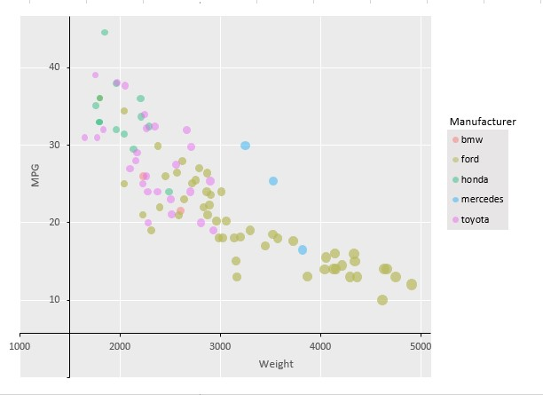

Assignment 2 - Data Visualization, 5 Ways  
===

# Excel

Excel is an extremely common tool used for making charts. So I thought I should finally make something using it.

Imputing the data was easy, but I had to do some manipulation. 
I sorted the data by the manufacturer and manually created each series group. 
I also deleted the values where the MPG was NA, since those bubbles would show up.
Excel did not immediately recognize the data MPG as numbers, so I had to edit each box.

Excel has okay axis controls, but it lacks direct control. I was able to replicate the scale, 
but I could not find a method to set the axes correctly. 
I could not set the axis intersection value lower than the minimum since it would default to the minimum. 
If I changed the minimum, then all the numbers would change. 
If I could fix the axes, the background would fix itself.
Getting tick marks without lines seems impossible, I saw some hacks for it that worked in older versions of excel.

In the future I would use Excel for quickly putting in data to see what it looked like or trying out different 
types of vis with the same dataset, but not for a final product.

# d3

D3 is the main library we are using in this course, so it was an easy choice for this project.
...

Write a paragraph for each vis tool/library you used/ Was 
it easy? Difficult? Where could you see the tool being useful in the future?
Did you have to use any hacks for data manip to get the right chart? Or anything else of note.

Design Achievements
--
The design achievement for this project was matching the color scheme as closely as possible. 
I first tried to pick colors directly from the image using a simple color picker. 
Unfortunately, the colors produced looked faded compared to the image, since the circles need to 
have 50% transparency, on a light-colored background. 

To get the actual colors I used a simple screen color picker tool I found, to match the output colors. 
I took my first vis in Excel, added the matching light grey background, and the 50% circle transparency.
With this simulation, I slowly changed the color inputs to match the color of the picture.

This produced the following color hex codes I used for all my vis recreations:

bmw: #F77973 

ford: #B0B24B

honda: #31BC80

mercedes: #2FB1F6

toyota:	#E86DF1

The color picker I used:
https://download.cnet.com/ScreenColorPicker/3000-2383_4-75796638.html

Technical Achievements
---

???? idk, might be something in D3, or maybe R, or some other tool
maybe annotations